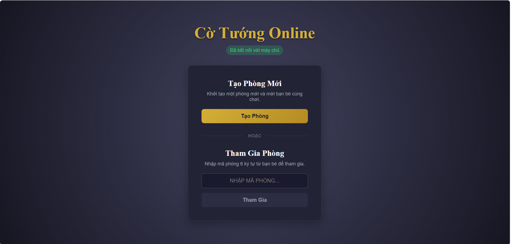
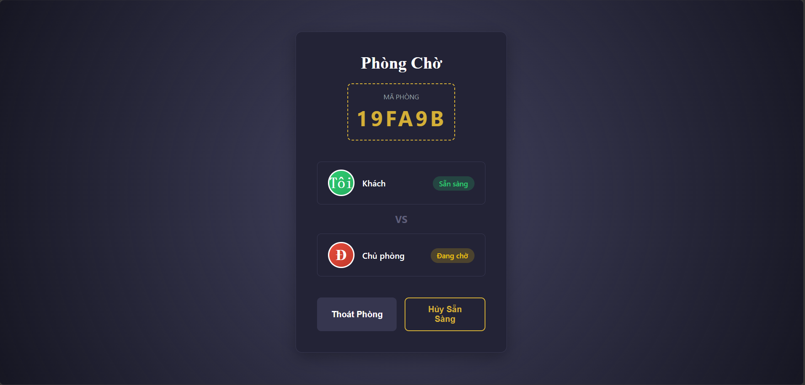
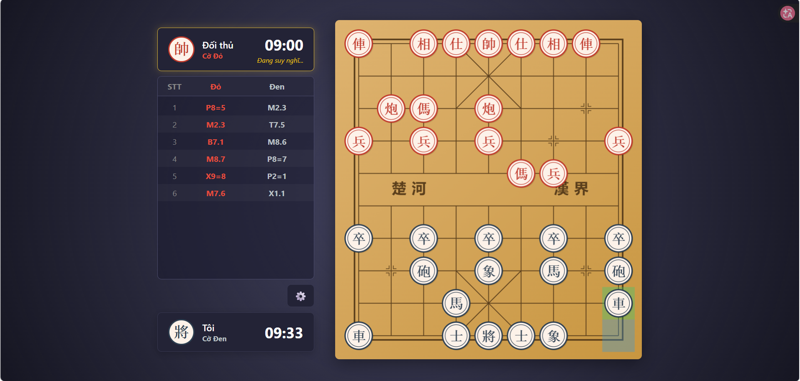

# Cờ Tướng Online (Xiangqi Web)

Một dự án nhỏ (Pet Project) thử nghiệm xây dựng game Cờ Tướng trực tuyến thời gian thực giữa 2 người chơi bằng React (TypeScript) và Spring Boot WebSocket.

---

## Hình ảnh Giao diện

### 1. Trang chủ (Home Screen)


### 2. Sảnh chờ (Lobby Screen)


### 3. Bàn cờ ván đấu (Game Screen)


---

## Mục đích dự án

Dự án được viết với mục đích học tập và luyện tập:
- Xử lý đồng bộ trạng thái thời gian thực qua WebSocket.
- Thiết kế Rule Engine (kiểm tra nước đi hợp lệ, chiếu tướng, chiếu hết) bằng Java.
- Quản lý bộ đếm giờ ngầm bằng `ScheduledExecutorService` (Min-Heap).
- Render bàn cờ trên Browser bằng HTML5 Canvas API.

Dự án giữ phạm vi đơn giản: **Không sử dụng Database**, dữ liệu phòng và ván đấu chỉ tồn tại trên RAM trong thời gian ván đấu diễn ra.

---

## Các chức năng đã thực hiện

- **Tạo & Vào phòng:**
  - Tạo phòng và vào phòng qua mã Room ID.
  - Phân ngẫu nhiên phe Đỏ / Đen khi 2 người chơi sẵn sàng.
- **Luật cờ (Rule Engine):**
  - Kiểm tra nước đi hợp lệ cho cả 7 loại quân cờ.
  - Kiểm tra chiếu tướng, chiếu hết và luật 2 Tướng đối mặt.
  - Hiệu ứng đỏ quanh Tướng khi bị chiếu.
- **Bộ đếm giờ:**
  - Đếm ngược thời gian mỗi lượt trên Server.
  - Tự động kết thúc ván đấu khi hết giờ.
- **Giao diện & Tua lại:**
  - Bàn cờ và quân cờ vẽ bằng Canvas.
  - Bảng danh sách nước đi (biên bản).
  - Phát âm thanh cơ bản (đi quân, ăn quân, chiếu).
  - Tùy chọn xem lại bàn cờ cuối ván và tua lại nước đi (Replay Mode) bằng phím mũi tên (`⬅️` / `➡️`).
  - Chức năng **Đầu hàng** riêng biệt (cho phép ở lại phòng xem lại bàn cờ chứ không văng ra sảnh ngay).

---

## Công nghệ sử dụng

### Frontend (`chess-client`)
- React, TypeScript, Vite.
- HTML5 Canvas API.
- Web Audio API (phát âm thanh).

### Backend (`chess-server`)
- Java 17+, Spring Boot.
- Spring WebSocket Handler (Tomcat WebSocket).
- Concurrent collections & `ScheduledExecutorService` (quản lý bộ đếm giờ).

---

## Cài đặt & Khởi chạy Local

### 1. Backend (`chess-server`)

```sh
cd chess-server

# Windows
.\mvnw spring-boot:run

# Linux / macOS
./mvnw spring-boot:run
```

Server chạy tại: `ws://localhost:8080/ws/chess`

### 2. Frontend (`chess-client`)

```sh
cd chess-client
npm install
npm run dev
```

Client chạy tại: `http://localhost:5173`

---

## Cấu trúc thư mục

```text
chess/
├── chess-server/                   # Backend Java Spring Boot
│   └── src/main/java/chess/server/
│       ├── model/                  # Entities (Game, Room, Board...)
│       ├── service/                # Logic phòng & ván đấu
│       ├── rule/                   # Luật di chuyển của các quân cờ
│       ├── protocol/               # WebSocket Messages & Payloads
│       └── handler/                # WebSocket Connection Handler
│
└── chess-client/                   # Frontend React TypeScript
    └── src/
        ├── components/             # Canvas, PlayerInfo, Modal...
        ├── hooks/                  # Custom WebSocket Hook (useWebSocket)
        ├── utils/                  # Canvas Renderer & Sound Player
        └── screens/                # Home, Lobby, Game screens
```
